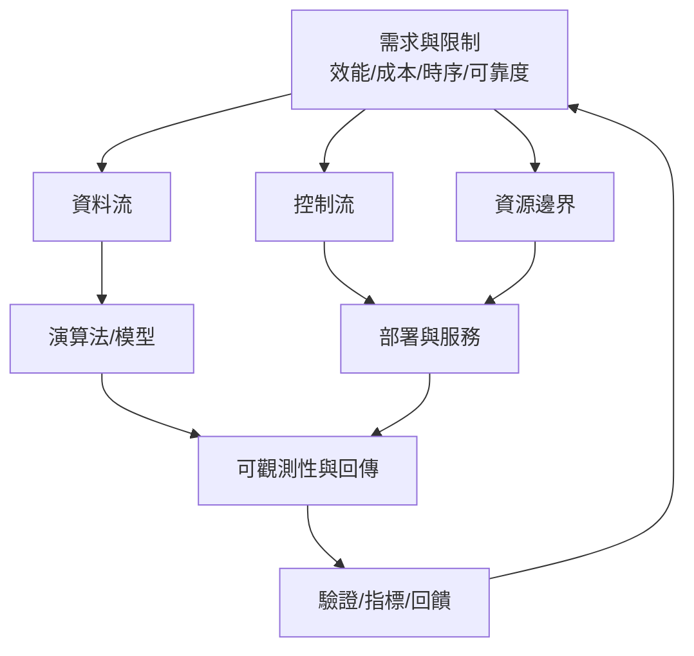
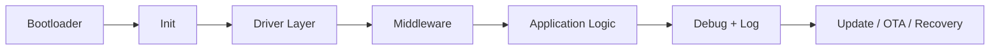
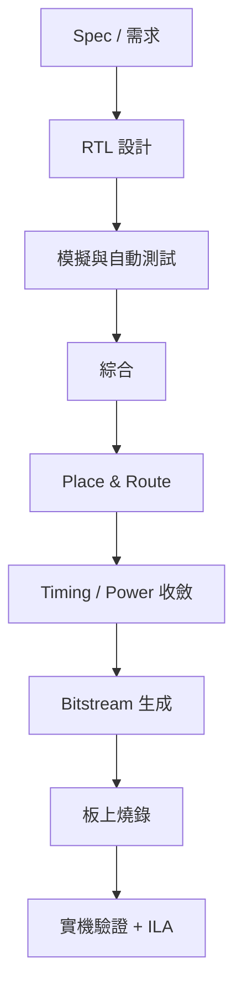

# 面試可用架構總表（先懂框架，再做題）

你不需要一開始就背所有模型細節；先用「架構」把能力打成一條線：

1. 資料怎麼進來（Input）
2. 資料怎麼轉成邏輯（Processing）
3. 輸出怎麼到用戶（Output）
4. 異常怎麼回收（Failure / Recovery）

以下三個方向都用同一套框架理解，這樣你在面試才會像工程師而不是背題機。

## 一、韌體工程師（C 語言）應會的架構

### 你要畫出來的基礎架構

### 面試上可直接說明的五件事
- 你怎麼分層：啟動、硬體抽象、業務邏輯、錯誤處理
- 你如何控制即時/資源：中斷、volatile、環境臨界區、暫存配置
- 指標怎麼定義：中位耗時、失敗率、重試率、復位率
- 限制怎麼處理：RAM/Flash、堆疊、ISR 時間、看門狗
- 失敗回復：看門狗、重試機制、保護性回退

### 你要能回答的核心問題（簡化版）
1) 這段 C 程式為什麼不會因為記憶體外掛導致系統崩潰？  
2) 中斷與主循環怎麼分工才能保證可預測行為？  
3) `volatile`、`static`、`const` 用在什麼場合最有意義？  
4) 你怎麼做初始化順序（GPIO、clock、bus、task）？  
5) 哪裡可以做快取、哪裡必須直接存取 register？

## 二、LLM 工程師的基本建構（系統架構觀點）

### 你要畫出來的基本查詢路徑

```mermaid
flowchart LR
  A[User Request] --> B[API Gateway]
  B --> C[Auth & Quota]
  C --> D[Router]
  D --> E[Context Builder]
  E --> F[Retrieval / Embedding]
  F --> G[LLM Inference]
  G --> H[Validator + PII/Fence]
  H --> I[Postprocess]
  I --> J[Response]
  J --> K[Trace + Metrics + Alert]
```

### 面試上可直接說明的五件事
- 你可以講「資料流」與「控制流」分開：資料進來先過安全與上下文再進模型
- 你知道如何降載與降錯：cache、batch、queue、model fallback
- 你能做資源預估：context 長度、batch 大小、KV cache、回應延遲
- 你知道最容易失敗的點：prompt 汙染、幻覺、超時、OOM
- 你會用指標衡量：P95 延遲、error rate、cost / token、回覆可接受率

### 你要能背的 30 秒版
「LLM 服務的核心不是模型本身，而是 `輸入清洗 -> 檢索增強 -> 控制生成 -> 監控回饋` 這條線。模型大小可變，架構不變；硬體不足就調路由與快取，不是硬衝大模型。」

## 三、FPGA 的架構與應用（面試可懂版）

### 你要畫出來的應用流程

### 面試上可直接說明的五件事
- 為什麼用 FPGA：低延遲、可硬體加速、可重構
- 你知道哪裡是瓶頸：clock period、timing closure、IO 時序、資源使用率（LUT/FF/BRAM）
- 你如何降低風險：先做 RTL simulation、再做行為驗證、最後做硬體驗證
- 你懂資料吞吐：pipeline、parallelism、buffer、flow control
- 你能解釋應用場景：影像前處理、加速推論前模組、訊號濾波、I/O 轉換

### 你要回答的核心問題（簡化版）
1) 為什麼這題要用 FPGA 而不是 MCU/CPU？  
2) 你怎麼處理時序失敗（timing）？  
3) 你如何驗證功能正確與功耗安全？  
4) 你做了什麼「模組化」，才能讓設計可重用？  
5) 燒錄與更新機制怎麼設計（rollback）？

## 你這三條怎麼合在一起
- 韌體：`時間與資源有邊界的真實世界控制`
- LLM：`資料與推論並行的服務世界`
- FPGA：`硬體路徑可預期、時序可驗證的加速世界`

你可以用這句過場（60 秒）：  
「我先把系統分成資料流、控制流、資源邊界；先用可證的架構定義安全邊界，再決定 C 韌體、LLM 服務、FPGA 模組各負責哪一層，最後用監控閉環做調整。」
