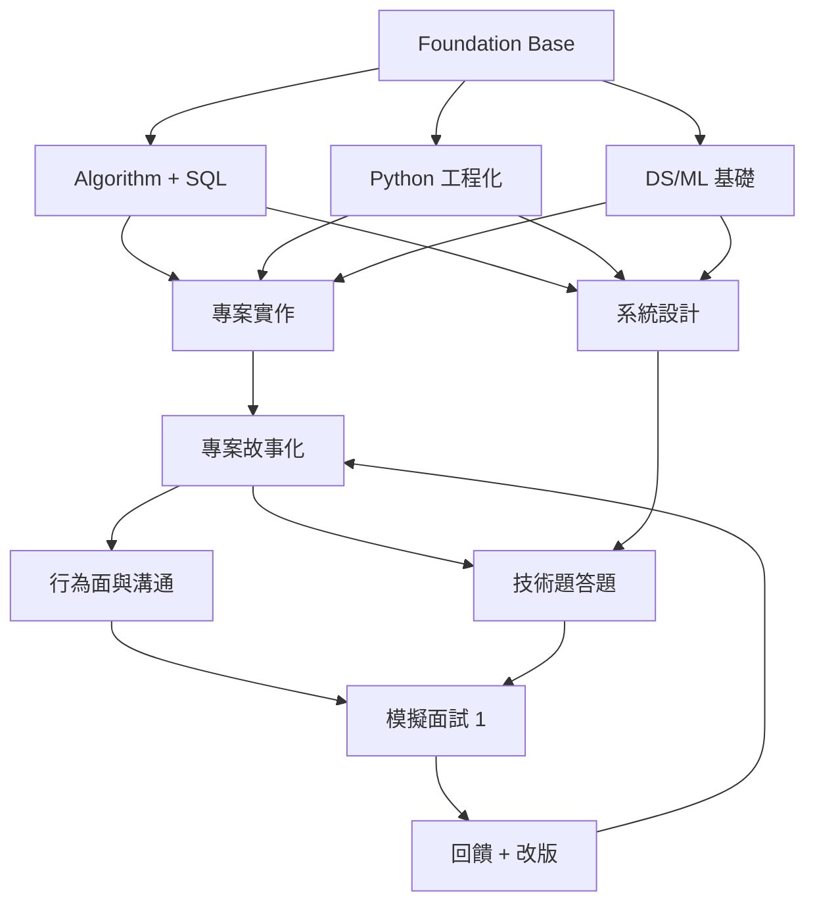

# 學習與面試提昇架構

## 四層架構
1. **底層能力層**：Python、Git、資料結構、SQL、統計
2. **實作層**：LLM 部署、資料處理、測試腳本、API、觀測
3. **表達層**：Project Story、STAR、白板圖示、架構說明
4. **輸出層**：履歷重整、作品展示、面試演練紀錄

## 你這個版本的主軸
- 不追求最新模型炫技
- 追求「可交付、可重現、可說清楚」
- 所有專案都要有：目標、指標、問題、修正紀錄
